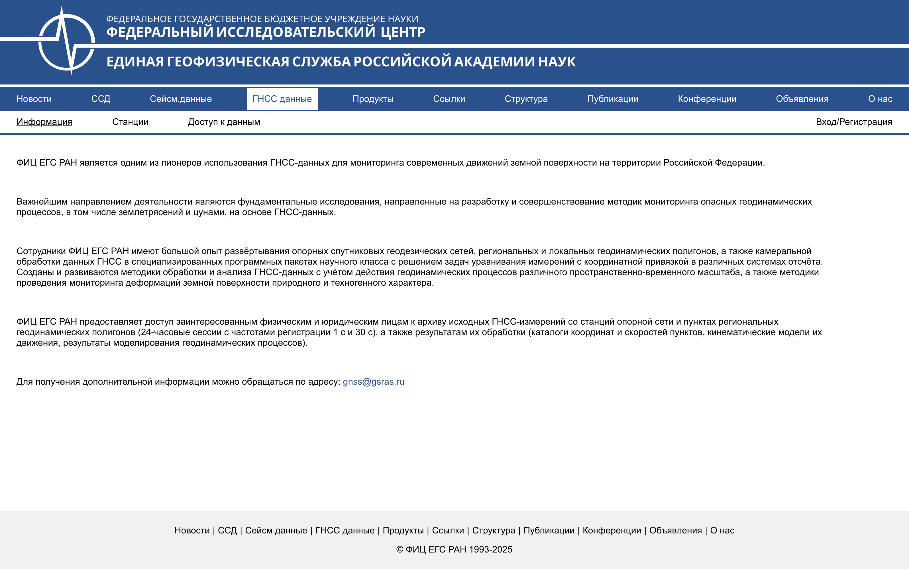
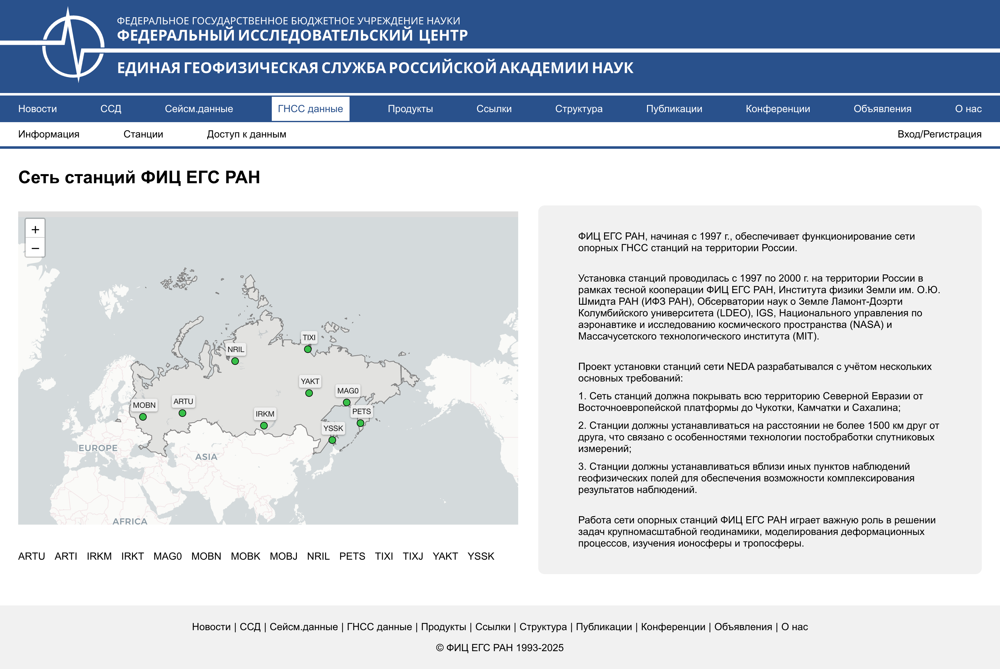
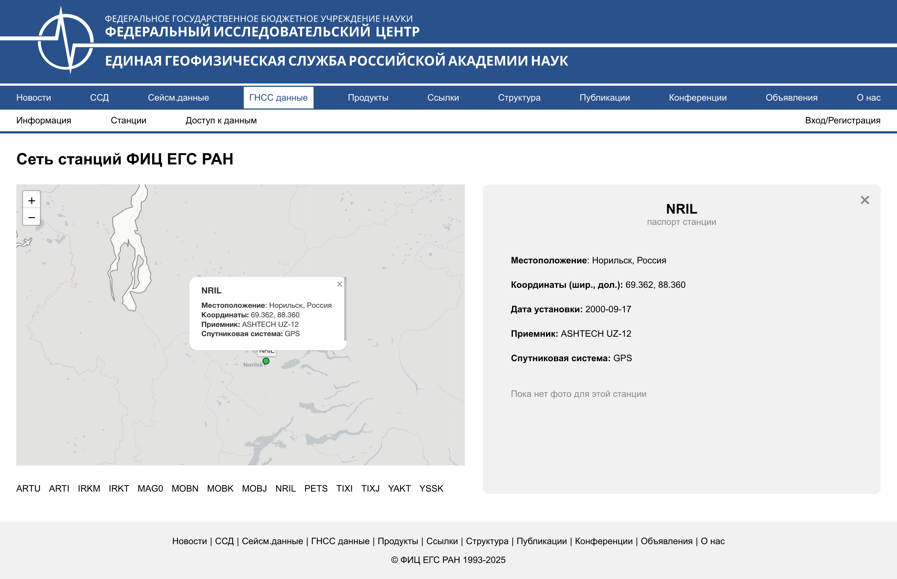
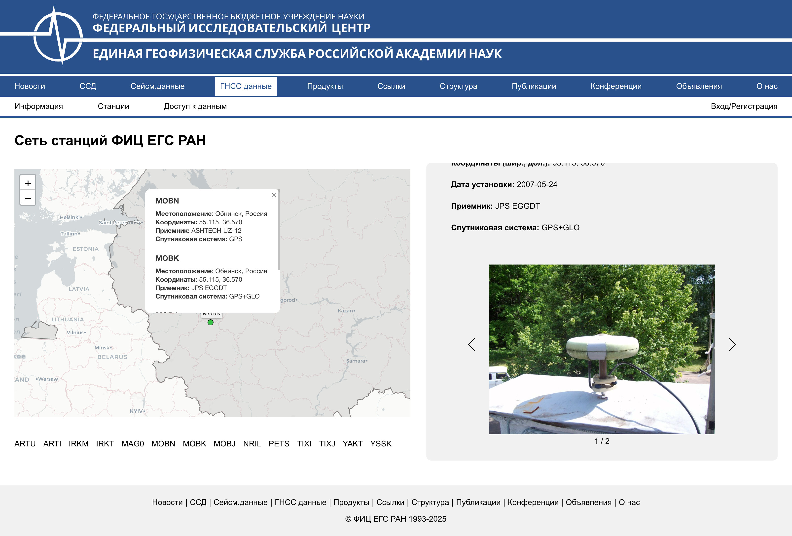
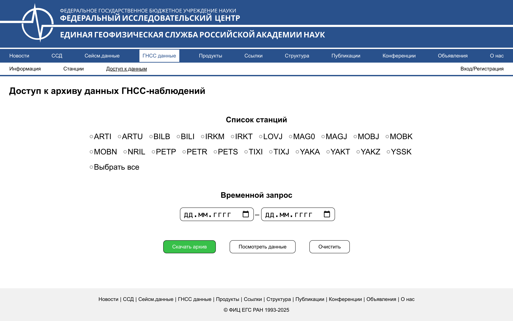
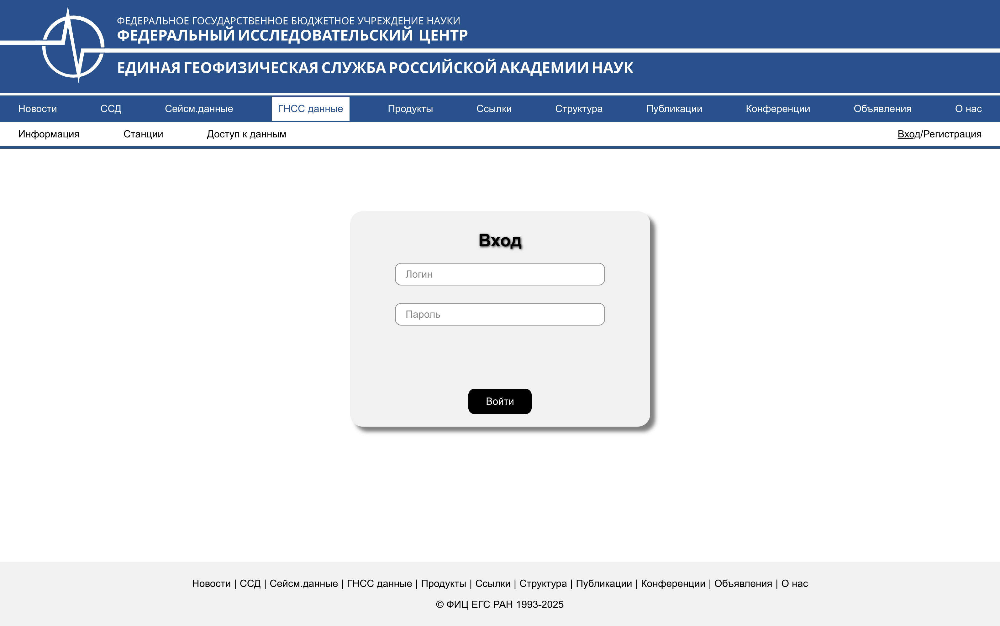

## О проекте

Веб-приложение для взаимодействия с базой данных ФИЦ ЕГС РАН и для доступа к паспортам станций. Здесь представлена только открытая часть исходного кода проекта.

### Цель

Разработать удобный и интуитивно понятный интерфейс для пользователей, который позволит в будущем работать с базой данных ФИЦ ЕГС РАН, а также просматривать паспорта станций

---

### Используемые технологии

- **React (Vite)**
- **Компонентный подход**
- **SCSS**
- **БЭМ-методология**
- **TypeScript**

### Структура проекта

- `src/components` — переиспользуемые атомарные компоненты (кнопки, инпуты, маркеры и т.д.)
- `src/modules` — крупные модули и контейнеры (карта, карточки станций, доступ к архиву и т.д.)
- `src/pages` — страницы приложения (авторизация, карта, доступ и т.д.)
- `src/services` — работа с внешними API и сервисами
- `src/constants` — константы и справочные данные (актуальные и архивные станции)
- `src/styles` — SCSS-переменные и миксины
- `src/assets` — статические ресурсы (иконки, изображения и т.д.)

---

### Реализовано

- [x] Карта с отображением актуальной сети станций (Leaflet)
- [x] Разделение справочника станций на архивные и актуальные (allStationNames, activeStations)
- [x] Форма авторизации
- [x] Форма регистрации
- [x] Стилизация по БЭМ и SCSS-переменным
- [x] Компонентная и модульная структура React
- [x] Использование переменных и миксинов в SCSS
- [x] Паспорт станции (Обзор, Антенна, Приемник, Фото)
- [x] Информационная страница
- [x] Использование алиас путей

---

### Установка и запуск

1. Клонируйте репозиторий:
   ```
   git clone https://github.com/your-username/interface-FIC-EGS-RAS.git
   ```
2. Установите зависимости:
   ```
   npm install
   ```
3. Запустите проект:
   ```
   npm run dev
   ```

---

### Планы по развитию

- Расширение паспорта станции (больше фото, подробности)
- Подключение к реальной базе данных и расширение API
- Адаптивная и мобильная верстка
- Валидация форм и улучшение UX
- Покрытие тестами
- Реализовать разграничение прав доступа

### Скриншоты













> Проект находится в стадии активной разработки
